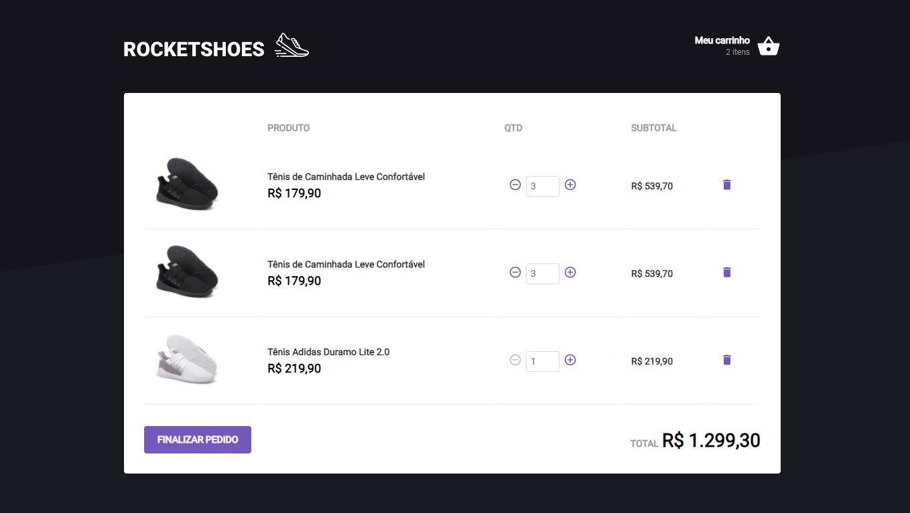

# Cart Hook

A challenge from Ignite's React track (Rocketseat course) that was proposed to implement some functionalities such as: adding a new product to the cart, removing a product from the cart, changing the quantity of a product in the cart, calculating sub-prices cart total and total, inventory validation, error message display, among others.

## Screenshots




## Setup

Go to the desired folder and run

```bash
  $ git clone https://github.com/matheustsdev/cart-hook.git

  $ cd cart-hook
```

Then, install the packages and run the development server with:
(NPM)

```bash
  $ npm install

  $ npm run start
```

or: (YARN)

```bash
  $ yarn

  $ yarn start
```

And you're ready to go!
